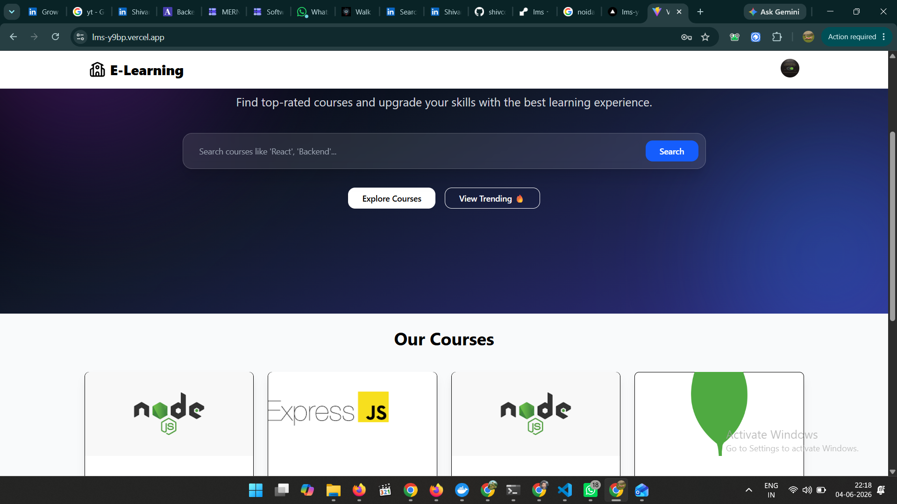
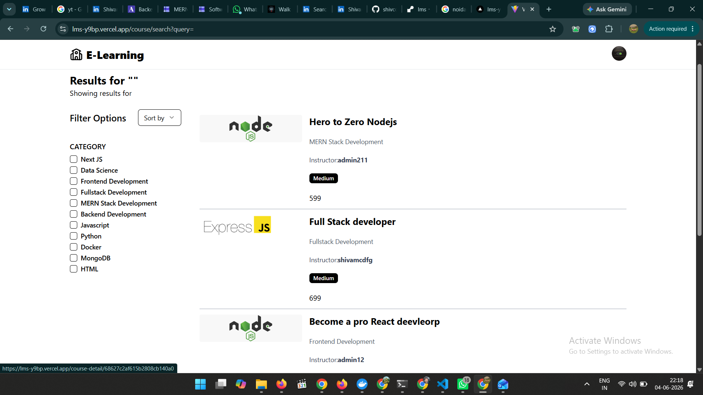
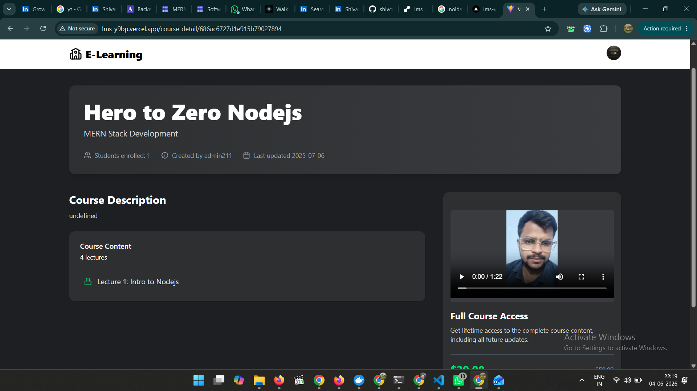
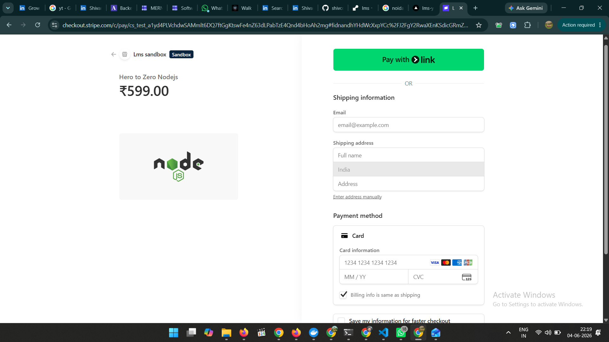
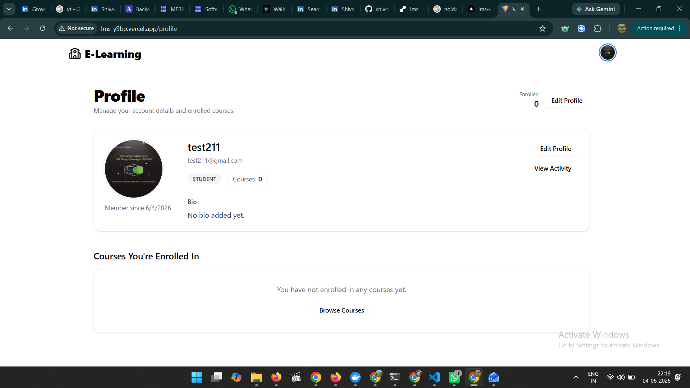

Learning Management System (LMS)

A full-stack Learning Management System (LMS) built with the MERN stack, featuring Role-Based Access Control (RBAC), course management, secure payments with Stripe, Redis caching, and a modern responsive UI.

-----

## 🚀 Features

### 🔐 Authentication & Authorization
- Secure JWT-based authentication
- Role-Based Access Control (RBAC)
- Student and Instructor roles
- Protected routes and middleware

### 👨‍🏫 Instructor Features
- Create, update, and delete courses
- Upload course thumbnails
- Add, edit, and delete lectures
- Publish/unpublish courses
- Manage course content through a dedicated dashboard

### 🎓 Student Features
- Browse available courses
- Advanced course filtering and search
- Purchase courses securely
- Access enrolled courses
- Watch course lectures after enrollment

### 💳 Payment Integration
- Secure course purchases using Stripe
- Stripe Checkout Session integration
- Payment verification and enrollment management

### ⚡ Performance Optimization
- Redis caching for course listings
- Reduced database load
- Faster course retrieval
- Improved user experience

--------------------------------------------------------

## 🛠️ Tech Stack

| Category | Technologies |
|-----------|-------------|
| Frontend | React.js, Redux Toolkit, React Router, Tailwind CSS, Axios, RTK Query |
| Backend | Node.js, Express.js, MongoDB, Mongoose |
| Caching | Redis |
| Payments | Stripe |
| Authentication | JWT, Cookie-based Authentication |
| Deployment | Vercel, Render, MongoDB Atlas, Redis Cloud |


-----------------------------
## 📂 Project Structure

```text
LMS/
├── client/
│   ├── public/
│   ├── src/
│   │   ├── app/
│   │   ├── assets/
│   │   ├── components/
│   │   ├── features/
│   │   ├── layout/
│   │   ├── lib/
│   │   ├── pages/
│   │   ├── App.jsx
│   │   ├── DarkMode.jsx
│   │   ├── main.jsx
│   │   └── index.css
│   ├── package.json
│   └── vite.config.js
│
├── server/
│   ├── controllers/
│   ├── database/
│   ├── middlewares/
│   ├── models/
│   ├── routes/
│   ├── upload/
│   ├── utils/
│   │   ├── cloudinary.js
│   │   ├── generateToken.js
│   │   ├── multer.js
│   │   └── redis.js
│   ├── index.js
│   └── package.json
│
└── README.md
```

------------

## Cache Flow
- Request arrives for all courses.
- Check Redis cache.
- If cache exists:
- Return cached data.
- If cache miss:
- Fetch from MongoDB.
- Store result in Redis.
- Return response.
- Cache Invalidation

## The cache is automatically cleared whenever:

- A course is created
- A course is updated
- A course is deleted
- A course is published/unpublished

This ensures users always receive fresh course data.

------------

🔐 RBAC Implementation

## Student
- Browse courses
- Purchase courses
- Access enrolled content

## Instructor
- Create courses
- Manage lectures
- Publish courses
- View course dashboard

------

## 💳 Stripe Payment Flow
- Student selects a course.
- Stripe Checkout Session is created.
- User completes payment securely.
- Enrollment is created after successful payment.
- Purchased course becomes available in the student's dashboard.

------

## 🌟 Key Highlights
- Full-stack MERN application
- Role-Based Access Control (RBAC)
- Instructor Course Management
- Stripe Payment Integration
- Redis Caching for Performance Optimization
- Advanced Course Filtering
- JWT Authentication
- Responsive User Interface
- Production Deployment

---------
## 📸 Screenshots






-------

## 🔧 Installation

Clone Repository

```
git clone https://github.com/shivcodecf/LMS.git
cd LMS

```
Backend Setup

```
cd server
npm install
npm run dev

```
Frontend Setup

```
cd client
npm install
npm run dev

```

Environment Variables

```
API_KEY=
API_SECRET=
CLOUD_NAME=
FRONTEND_URL=
MONGO_URI=
PORT=8080=
SECRET_KEY=
STRIPE_PUBLISHABLE_KEY=
STRIPE_SECRET_KEY=
WEBHOOK_ENDPOINT_SECRET=


```

----

## 👨‍💻 Author

<h3 align="center">Shivam Yadav</h3>

<p align="center">
Backend-Focused Software Developer passionate about building scalable web applications, REST APIs, caching systems, and cloud-based solutions.
</p>

<p align="center">
  <a href="https://github.com/shivcodecf">
    
  </a>
  <a href="https://www.linkedin.com/in/shivam-yadav-620a03232/">
    
  </a>
</p>

### 💡 Interests

- Backend Development
- System Design
- Redis Caching
- REST API Development
- Cloud Deployment
- Performance Optimization